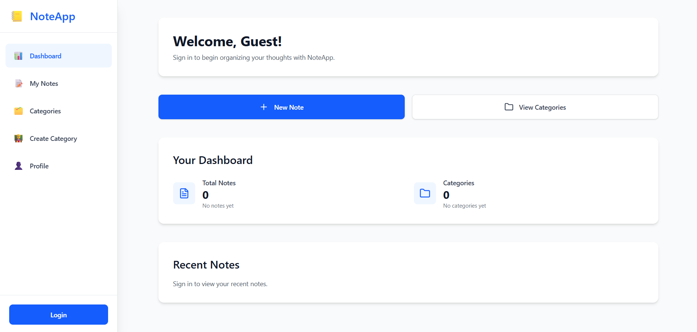
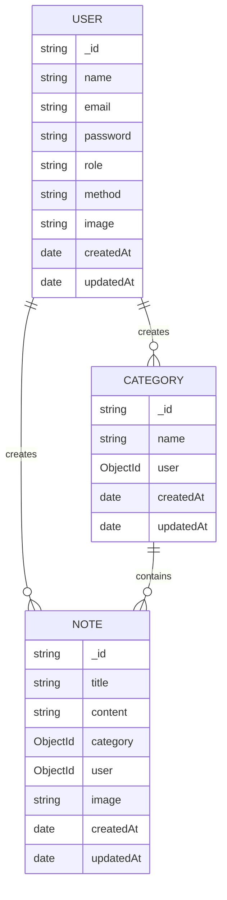

# Note Organizer - Your Smart Note-Taking Solution 🚀



## Overview 📝

Note Organizer is a full-stack application that helps you capture, organize, and manage your notes efficiently. With a beautiful interface and powerful features, it's designed to boost your productivity.

## Key Features ✨

### 🔐 Secure Authentication
- Email/password login
- Social login (Google, GitHub)
- JWT token-based security

### 📝 Smart Note Management
- Create, edit, and delete notes
- Categorize notes for better organization
- Rich text formatting
- Image attachments

### 📊 Dashboard Insights
- Overview of all notes
- Category statistics
- Quick access to recent notes

### ☁️ Cloud Integration
- Cloudinary image storage
- Automatic backups
- Cross-device sync

## Live Demo 🌐

👉 [Frontend Deployment](https://frontend-nine-wheat-31.vercel.app)  
👉 [Backend API](https://note-backend-pink.vercel.app)

## Technology Stack 🛠️

### Frontend
| Technology | Purpose |
|------------|---------|
| Next.js 14 | React framework |
| TypeScript | Type safety |
| Tailwind CSS | Modern styling |
| NextAuth.js | Authentication |
| React Hook Form | Form handling |
| Sonner | Toast notifications |

### Backend
| Technology | Purpose |
|------------|---------|
| Node.js | Runtime environment |
| Express | Web framework |
| MongoDB | Database |
| Mongoose | ODM |
| JWT | Authentication |
| Cloudinary | Image storage |

## Screenshots 📸


*Secure login with multiple options*


*Rich text editor with formatting options*

## Getting Started 🚀

### Prerequisites
- Node.js v18+
- MongoDB Atlas account
- Cloudinary account (for image storage)

### Installation

1. **Clone the repository**
   ```bash
   git clone https://github.com/saurav11sarkar/note-organizer-application.git
   cd note-organizer-application
   ```

2. **Set up environment variables**
   ```bash
   cp .env.example .env.local
   # Fill in your credentials
   ```

3. **Install dependencies**
   ```bash
   npm install
   ```

4. **Run the development server**
   ```bash
   npm run dev
   ```

5. **Open in browser**
   ```
   http://localhost:3000
   ```

## API Documentation 📚

Our backend provides a robust REST API with the following endpoints:

### Authentication
- `POST /api/user/register` - Register new user
- `POST /api/user/login` - User login
- `POST /api/user/refreshToken` - Refresh access token

### Notes
- `GET /api/note` - Get all notes (paginated)
- `POST /api/note` - Create new note
- `GET /api/note/:id` - Get single note
- `PUT /api/note/:id` - Update note
- `DELETE /api/note/:id` - Delete note

### Categories
- `GET /api/category` - Get all categories
- `POST /api/category` - Create new category
- `GET /api/category/:id` - Get single category
- `PUT /api/category/:id` - Update category
- `DELETE /api/category/:id` - Delete category

## Database Schema 🗃️



## Security Features 🔒

- **Authentication**: JWT with refresh tokens
- **Authorization**: Role-based access control
- **Data Protection**: Password hashing with bcrypt
- **Secure Headers**: Helmet middleware
- **CSRF Protection**: SameSite cookies
- **Rate Limiting**: 100 requests/minute for auth users

## Contributing 🤝

We welcome contributions! Here's how:

1. Fork the repository
2. Create your feature branch (`git checkout -b feature/AmazingFeature`)
3. Commit your changes (`git commit -m 'Add some feature'`)
4. Push to the branch (`git push origin feature/AmazingFeature`)
5. Open a Pull Request

## License 📄

This project is licensed under the MIT License - see the [LICENSE](LICENSE) file for details.

## Contact 📧

**Saurav Sarkar**  
📧 [sarkar15-4285@diu.edu.bd](mailto:sarkar15-4285@diu.edu.bd)  
💻 [GitHub Profile](https://github.com/saurav11sarkar)  
🔗 [LinkedIn](https://www.linkedin.com/in/saurav-sarkar-2a573b368)

📞 [01518643073](01518643073)

---

Happy Note Taking! 📝✨